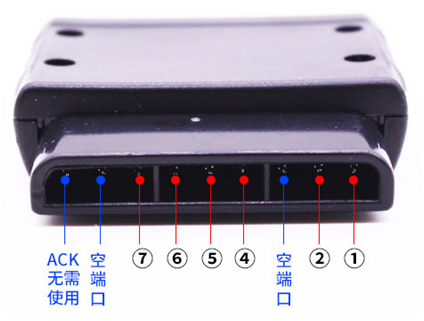
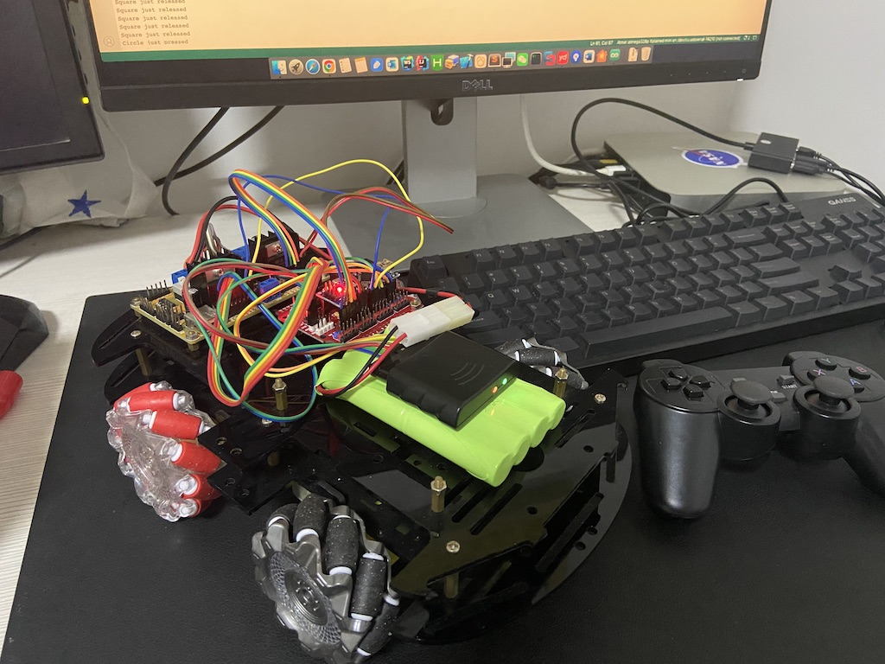

# ps2x_smart_car

===

===

> PWM（Pulse Width Modulation）调速是一种通过调节脉冲宽度的方式来控制电机或其他设备的转速或输出功率的技术。
通过调整PWM信号的占空比（高电平与低电平时间的比例），可以改变电机的平均电压或电流，从而控制电机的转速。 
根据手柄的摇杆或按钮状态来实现智能车的调速、前进、后退、转向、平移、斜行、旋转等操作。
## 轮型:
- [x] [普通轮子](https://en.wikipedia.org/wiki/Wheel)
- [x] [麦克纳姆轮](https://en.wikipedia.org/wiki/Mecanum_wheel)

## 硬件清单 

|名称|型号|备注|
| ------- | ------- | ------- |
|芯片|ATmega328P|[Arduino Nano](http://www.taichi-maker.com/homepage/reference-index/arduino-hardware-refrence/arduino-nano/)|
|驱动|L298N|[Schemetics](./PS2X_smartCar/L298DriveModuleSchematicDiagram.pdf)|
|稳压|LM2596|DC-DC|
|电池|9.6V 8000MA|大田宫端头|
|电机|TT Motor|测速编码|
|车架|Acrylic||
|手柄|ps2||

## 接收器端口
|接口|端口|芯片|
| ------- | ------- | ------- |
|Data|①|12|
|Command|②|11|
|Ground|④|GND|
|Power|⑤|3v3|
|Attention|⑥|10|
|Clock|⑦|13|

## 实物展示
To view the video, you can view the demo [here](https://www.bilibili.com/video/BV1ty4y1A7vB)

## 联系方式
* E-mail: niyongsheng@Outlook.com
* Weibo: [@Ni永胜](https://weibo.com/u/7317805089)
